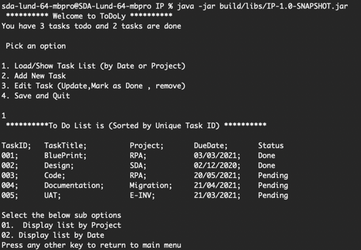
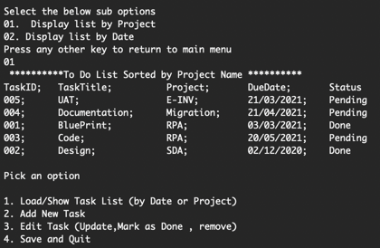
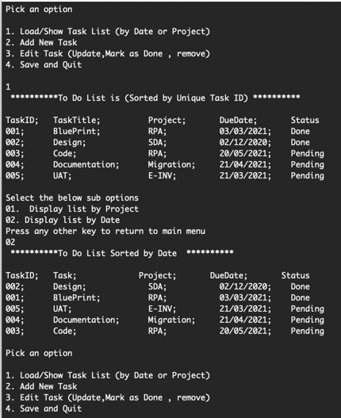
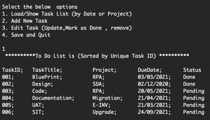
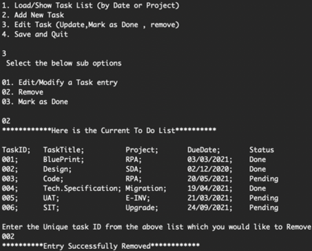
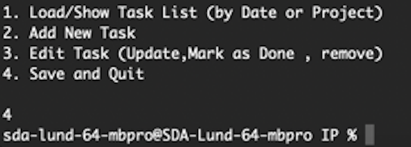

# ToDoList App
This application will allow a user to create new tasks, assign them a title and due date, 
and choose a project for that task to belong to. They will need to use a text based user interface via the command-line . 
Once they are using the application, the user should be able to also edit, mark as done or remove tasks. 
They can also quit and save the current task list to file, and then restart the application with the former state restored.
## Getting started
This application can be run directly via Gradle or via generated jar file.
### Run with gradle
In the root folder,start the application with gradle's run command .
````
gradle run --console plain
````
### Run with jar file
Generate the jar file with Gradle's build command 
```bash
gradle build
````
The jar file will be generated in `build/libs` which can be run by a java environment.
```bash
java -jar build/libs/IP-1.0-SNAPSHOT.jar
````
## Usage
1:	**Select option from the menu. Press '1' to Load/Show Task List , sorted by Task ID - Default:**



2: **In the sub option , select 01 to sort and display the task list by project. You will also return to main menu :**



3 : **Now from the Main Menu , select option 1 and from sub option 02 to sort and display the task list by Date.You will also return to main menu :**



4 : **From the Main Menu , Select Option 2 to Add new Task. Now enter the new task title , project and Due date.New task will be added with initial status 'Pending':**


5: **You can validate , the new task added by selecting option 1 from Main menu:**



6:  **From the Main Menu ,select option 3 to Edit , Remove or Mark a task as Done. Here sub options will be presented to select required operation.Select sub option 01 to Edit a task by selecting unique TaskID**


7:  **From the Main Menu ,select option 3 and sub option 02 to Remove a task by providing unique task ID from the list:**



8:  **From the Main Menu ,select option 3 and sub option 03 to mark a task 'Done' by providing unique task ID from the list. The modified list is also displayed to validate the EDIT operations done :**


9:  **From the Main Menu , select option 4 to save the task list in the file and quit the app:**



